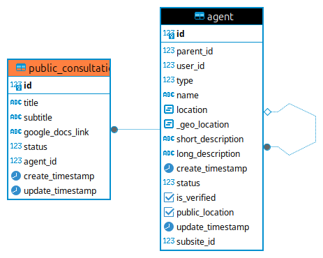

# plugin-PublicConsultation

Plugin que realiza o gerenciamento na plataforma Mapa Cultural de links para consulta pública sobre a construção de editais.

## ✨ Informações sobre o plugin

**Contexto**: Atualmente a realização das construções dos editais da Secretaria da Cultura estão sendo realizadas pelas coordenações responsáveis junto ao jurídico. Com isso, surgiu a ideia de ao realizar a construção de um edital, receber sugestões do público em geral.

**Objetivo**: Permitir o gerenciamento (CRUD) e disponibilizar os links para as consultas públicas.

### Estrutura

## 🚀 Instalação

Instalação padrão como recomenda a [documentação](https://mapasculturais.gitbook.io/documentacao-para-desenvolvedores/formacao-para-desenvolvedores/plugins) oficial.

- 🆙 - Acessar o container da aplicação, na pasta /var/www/scripts e rodar `./db-update`
- Na pasta raiz, crie o arquivo `.env` baseado no arquivo `.env.example`
- Na variável `SEAL_ID` informe o ID do selo que está atribuído aos agentes que terão permissão de executar as ações (CRUD) da consulta pública

### Observação

Somente os agentes que tiverem o selo atribuído a eles poderão realizar o gerenciamento das consultas públicas.
